## Basic Features

The basic feature of the plugin is to help you record your current activity. Open the sidebar dock panel registered by the plugin to display multiple activities.

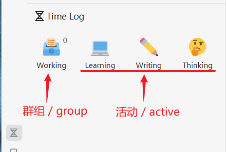

### Activity Recording

* Activity Recording: When we click on an activity, a timer will appear to record the current ongoing activity. You can open multiple activities at once.

  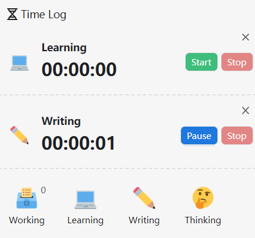

* Pause

  Click "Pause" to stop the timer.

* Stop

  Click "Stop" to stop the timer, exit the activity, and save the activity log.

* Delete

  Click the "x" in the upper right corner to delete the current timer, exit the activity, and do not keep the activity log.

* Note

  Click on the timer in the middle of the ongoing activity to enter a note for this activity.

  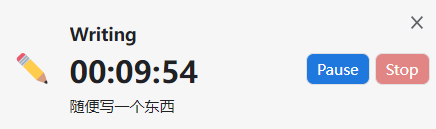

### Groups

The "Groups" with numbered indicators in the upper right corner are the sub-activity items displayed when opened.

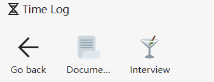

## View Past Records

Click the "Records" button in the upper right corner to view the saved activity records in the past. Show all the records this year by default.

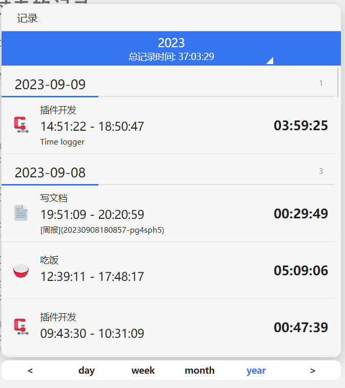

## Configuration

You can freely configure the activities and groups you want. Click the "Settings" button in the upper right corner.

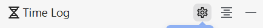

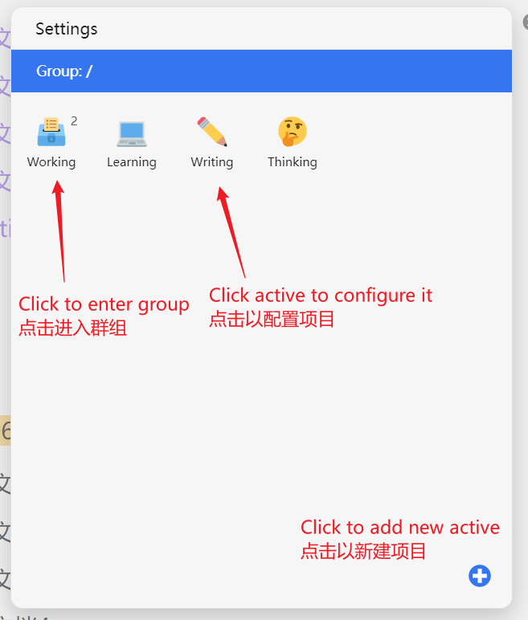

### Click on an activity to change related information

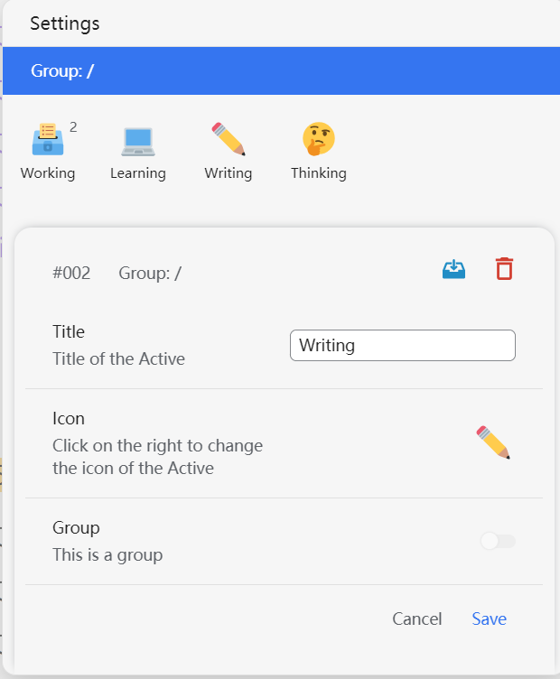

* Change the title
* Click on the icon to change the icon

  * The custom section is the user's own icon, so if you want to use a custom icon, you can download an SVG file and place it in the `Workspace/data/emojis/` directory.
  * It is recommended to download emoji plugins in the market to replace the native expressions, otherwise the formatting here will look bad.

  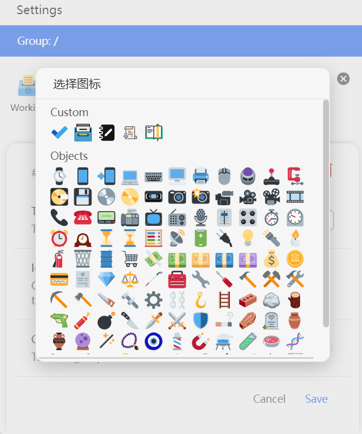

* Delete activity
* Move to another group

  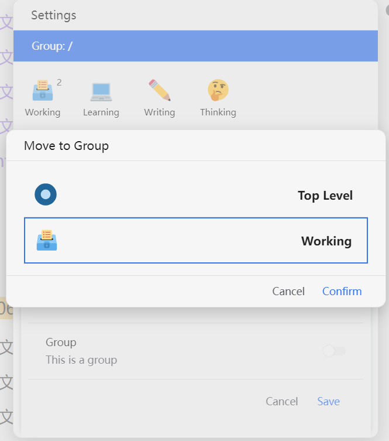

* Remember to click the "Save" button.

### Enter a group

After clicking on a group, you can enter the activities in the group configuration.

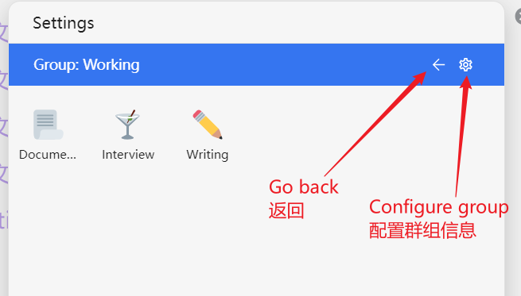

### Click the bottom right corner icon to add a new item

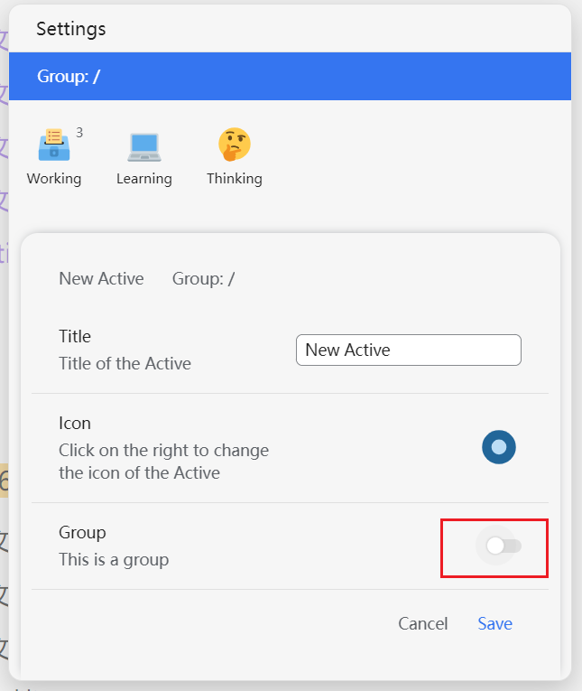

> Note: A newly created item can be set as a "Group", and once set as a group, it cannot be changed later.

If you create a new item under a group, this item will be assigned to that group by default.

### Drag icons to change the layout order

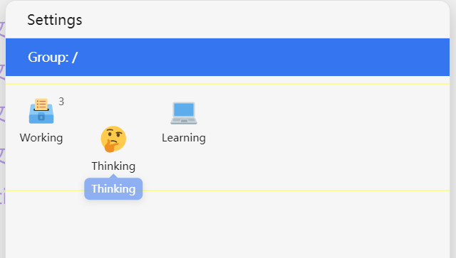

## Acknowledgement

- This plugin is heavily inspired by aTimeLogger, of which I am a paid user. However, I'm not accustomed to recording activities on my phone, so I created this plugin version called Time Logger.

- The english version of this readme is translated by ChatGPT, from Zh_CN version
