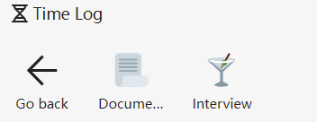
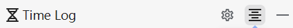
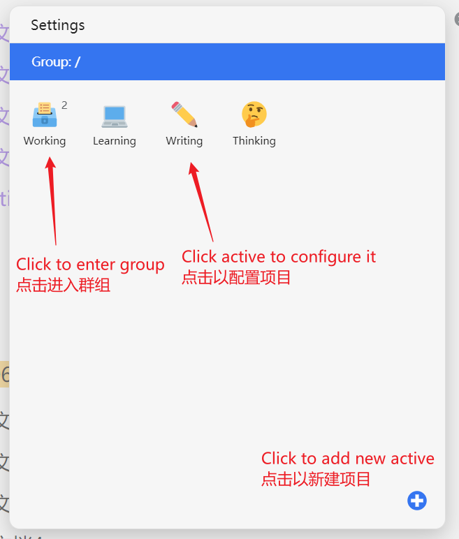
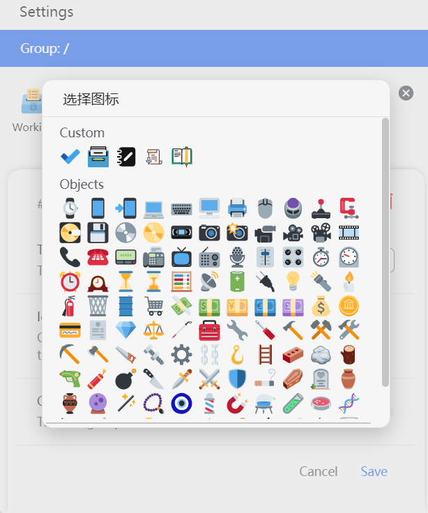
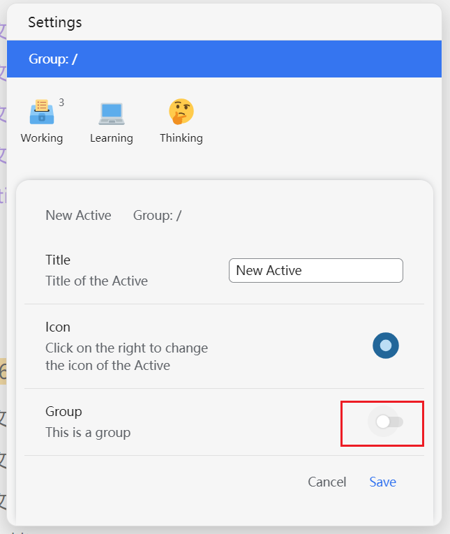

> 感谢 aTimeLogger, 我是你们的付费用户, 但我不喜欢在手机上记录, 所以我做了一个一样的工具

## 基本功能

　　插件的基本功能是帮助你记录当前的活动。点开插件注册的侧边栏 dock 面板。可以展示若干的活动。

　　​

### 活动记录

* 活动记录：当我们点击活动的时候，就会出现一个计时器，记录当前正在进行的活动。你可以一次性开启多个活动

  ​​
* 暂停

  点击「暂停」，计时器将会停止
* 停止

  点击「停止」，计时器就会停止，同时退出该活动并保存活动的记录日志
* 删除

  点击右上角的「x」，可以删除当前计时器，退出活动，且不保留活动的记录日志
* 备注

  点击正在进行中的活动中间的计时器，可以输入对这个活动的备注

  ​​

### 群组

　　右上角带有数字标号的是「群组」，点开后可以展示里面的子活动项目。

　　​​

## 查看过去的记录

　　点击右上角的「记录」按钮，可以查看过去所有保存的活动记录。

　　​​

　　​​

## 配置

　　你可以自由地配置自己想要的活动和群组。点击右上角的「设置」按钮

　　​​

　　​​

### 点击活动更改相关信息

　　​​

* 更改标题
* 点击图标更改图标

  * custom 部分是用户自己的图标，所以如果你想要使用自定义图标，可以自己去下载 svg 文件，然后放在 `工作空间/data/emojis/`​ 目录下。

  ​​
* 删除活动
* 移动到其他群组中

  ​​
* 记得点击「保存」按钮

### 进入群组

　　点击群组后，可以进入群组配置里面的活动。

　　​​

### 点击右下角图标添加新的项目

　　​

> 注意：一个新建的项目可以设置为「群组」，且一旦设置为群组后续不能更改。

　　如果你在某个群组下新建项目，那么这个项目默认归属于这个群组。

### 拖动图标更改排布顺序

　　​​

